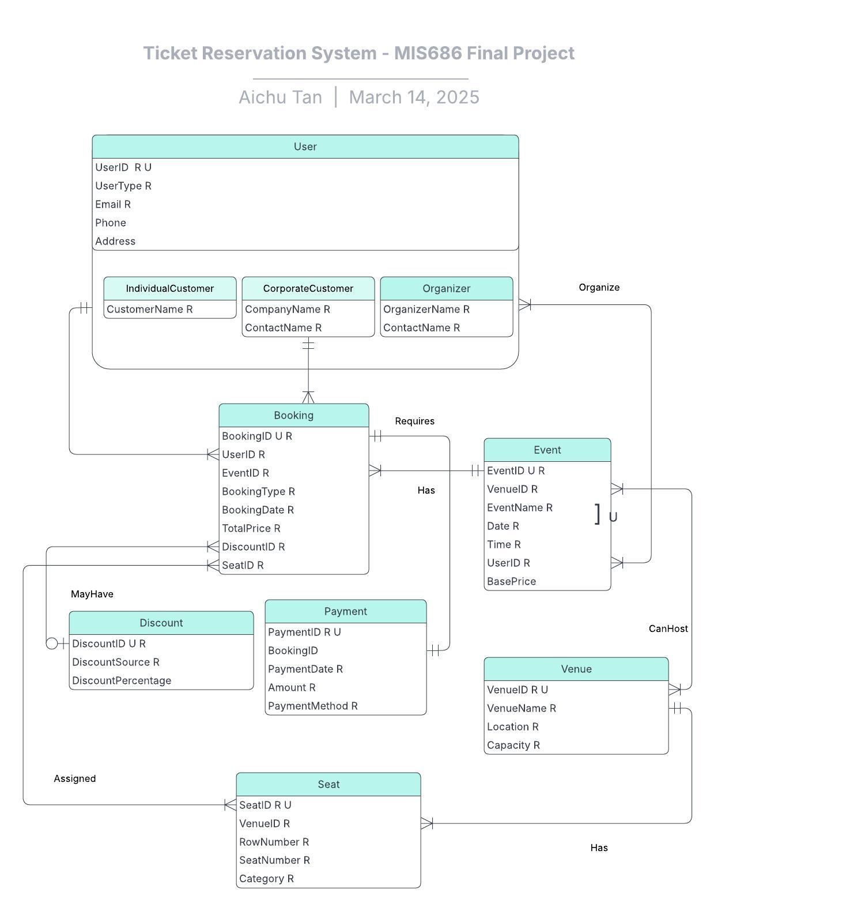
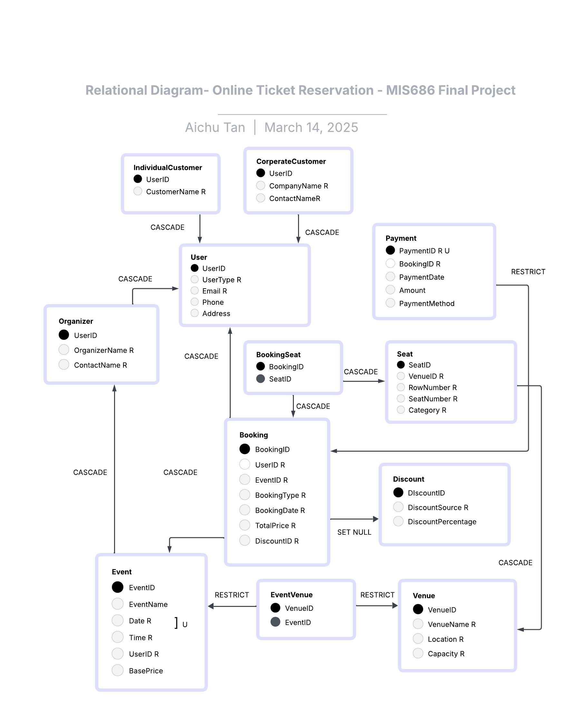

## Online Ticket Database Management System
This project is part of the MIS 686 class.  
The term project consists of five main steps:
1. Topic/Domain Selection
2. Conceptual Data Modeling and Database Design
3. Database Implementation
4. Deploying the Database
5. Developing Analytical Questions and Creating a Dashboard

##  Live Project

Explore the live deployment of the project, including dashboard visualizations and project documentation:

▶ **[Live Site: Online Ticket Database Management System](https://aichutan.github.io/Online-Ticket-Database-Management-System/)**

### Table of Contents
#### Part I: Topic Selection
- **Selected Topic**: Music Streaming Platform Database
- **Overview**
- **Business Rules**
- **Use Cases**

#### Part II: Conceptual Data Modeling and Database Design
- **ERD**
- **Relational Diagram**

#### Part III: Database Implementation
- **DDL SQL Statements**
- **Dummy Data (DML SQL Statements)**

#### Part IV: Database Deployment
- **Database Deployment Screenshots (AWS)**
- **User Access Management Screenshots (AWS)**
  - mis686-database-admin user
  - mis686-database-read user
- **Index, View, Trigger, Stored Procedures (SQL Statements)**

#### Part V: Analytical Questions and Dashboard
- **Analytical Questions**
- **Dashboard Screenshots**

[Video Presentation](https://video.pictory.ai/1742097571858/20250316043142016heFjmoHLuD6RXRd)

---

### Part I: Topic Selection:
**Online Ticket Reservation Database System**

#### Overview:
This database is designed to support an online ticket reservation system that manages multiple events across various venues. It facilitates ticket purchases for both individual and corporate customers, incorporating special discounts through corporate promotions, Groupon deals, or individual offers, which may be applied as a different percentage discount.  
The system accommodates multiple payment methods, including credit cards, PayPal, bank transfers, and cash. Each venue has a distinct seating capacity, categorized into three tiers: VIP, Regular, and Economy.  
The primary objective of this database is to provide online businesses with data-driven insights by analyzing revenue trends, optimizing ticket sales, understanding customer behavior, and identifying the most profitable events to enhance business growth.

#### Business Rules:
- Each user must have a unique identifier and username.
- Users can be individual customers, corporate clients, or event organizers.
- Users can make multiple bookings.
- Each booking may have at most one discount, which can originate from different sources, such as company discounts, Groupon promotions, or general promotional offers.
- Each event can have multiple bookings.
- Each booking requires a single payment method.
- An event may take place at multiple locations, and each venue can host multiple events.
- Each venue contains multiple seats, but each seat belongs to only one venue.
- A booking can include multiple seats, and each seat may be booked under different bookings (many-to-many relationship between bookings and seats).
- Each event has a unique name and date.

#### Part II: Conceptual Data Modeling and Database Design

- **ERD**  


- **Relational Diagram**  


### Part III: Database Implementation

1. **DDL SQL Statements**:  
   - [TicketReservationSystem.sql](./TicketReservationSystem.sql)

2. **Dummy Data Generation**:  
   Data was generated using ChatGPT and supplemented with fake data in Google Sheets. The data was then saved as a CSV file and imported into MySQL. Below is a portion of how the dummy data was inserted. For the complete file, please refer to [TicketReservationData.sql](./TicketReservationData.sql).

   ```sql
   -- Example of inserting dummy data for IndividualCustomer
   INSERT INTO IndividualCustomer (CustomerID, CustomerName, Email) 
   VALUES (1, 'John Doe', 'john.doe@example.com');

### Part IV: Database Deployment

#### Database Deployment:
The physical design was implemented on AWS's RDS platform. The database name is **database-mis686-tp** with the following configurations:  


#### User Access Management:
An IAM group was created for this project: **mis686-final-group-AT**, with two users:
- **mis686-databaseAT-admin**: Provides access to RDS (including modification), VPC, and CloudWatch to make modifications to accessibility, configuration, and logs/alarms for database performance and alerts.
- **mis686-database-user**: Grants read-only access to the database for users to query or view the data without permissions to modify the underlying database.


- **mis686-databaseAT-admin**  


#### Index, View, Trigger, Stored Procedures (SQL Statements):

**Index Example**:
- To create an index on `CustomerName` for `IndividualCustomer` for faster lookup:

   ```sql
   CREATE INDEX idx_customer_name ON IndividualCustomer(CustomerName);

**Index Example**:
- To create an index on `CompanyName` for `CorporateCustomer` for faster lookup:

   ```sql
   CREATE INDEX idx_company_name ON CorporateCustomer(CompanyName);
**View Example**:
- To create a view to display the top events based on the highest total revenue (calculated as `TotalPrice` from the `Booking` table):

   ```sql
   CREATE VIEW TopEventsByRevenue AS
   SELECT
     e.EventID,
     e.EventName,
     e.Date,
     e.Time,
     SUM(b.TotalPrice) AS TotalRevenue,
     COUNT(b.BookingID) AS TotalBookings
   FROM
     Event e
   JOIN
     Booking b ON e.EventID = b.EventID
   GROUP BY
     e.EventID, e.EventName, e.Date, e.Time
   ORDER BY
     TotalRevenue DSC;

**Trigger Example**:
- To ensure that the booking date is before the event date:

   ```sql
   DELIMITER //
   CREATE TRIGGER check_booking_date
   BEFORE INSERT ON Booking
   FOR EACH ROW
   BEGIN
     DECLARE event_date DATE;
     -- Fetch the event date for the corresponding EventID
     SELECT Date INTO event_date FROM Event WHERE EventID = NEW.EventID;
     -- Check if the booking date is before the event date
     IF NEW.BookingDate >= event_date THEN
       SIGNAL SQLSTATE '45000'
       SET MESSAGE_TEXT = 'Error: Booking date must be before the event date.';
     END IF;
   END;
   //
   DELIMITER ;

**Stored Procedure Example**:
- To create a stored procedure that inserts a new booking into the `Booking` table:

   ```sql
   DELIMITER //
   CREATE PROCEDURE InsertBooking (
     IN p_BookingID INT,
     IN p_UserID INT,
     IN p_EventID INT,
     IN p_BookingType VARCHAR(20),
     IN p_BookingDate DATE,
     IN p_TotalPrice DECIMAL(10,2),
     IN p_DiscountID INT
   )
   BEGIN
     -- Check if p_BookingType is valid
     IF p_BookingType NOT IN ('Individual', 'Group') THEN
       SIGNAL SQLSTATE '45000' 
       SET MESSAGE_TEXT = 'Invalid BookingType. Must be "Individual" or "Group".';
     ELSE
       INSERT INTO Booking (BookingID, UserID, EventID, BookingType, BookingDate, TotalPrice, DiscountID)
       VALUES (p_BookingID, p_UserID, p_EventID, p_BookingType, p_BookingDate, p_TotalPrice, p_DiscountID);
     END IF;
   END; //
   DELIMITER ;
### Part V: Analytical Questions and Dashboard

#### Analytical Questions

1. **Revenue Analytics**:
   - **Question**: Which events are generating the most revenue?
   - **Solution**: To show the events and their total revenue, and sort them in descending order to identify which events generate the most income:

   ```sql
   SELECT
     E.EventName,
     SUM(P.Amount) AS TotalRevenue
   FROM
     Payment P
   JOIN
     Booking B ON P.BookingID = B.BookingID
   JOIN
     Event E ON B.EventID = E.EventID
   GROUP BY
     E.EventName
   ORDER BY
     TotalRevenue DESC
   LIMIT 10;

2. **Monthly Revenue Trend**:
   - **Question**: How has our monthly revenue trended over the past year?
   - **Solution**: To display monthly revenue growth:

   ```sql
   SELECT
     DATE_FORMAT(P.PaymentDate, '%Y-%m') AS Month,
     SUM(P.Amount) AS TotalRevenue
   FROM
     Payment P
   GROUP BY
     Month
   ORDER BY
     Month;


3. **Venue Revenue Contribution**:
   - **Question**: Which venues contribute most significantly to our overall revenue?
   - **Solution**: To highlight venues ranked by total revenue contribution:

   ```sql
   SELECT
     V.VenueName,
     SUM(P.Amount) AS TotalRevenue
   FROM
     Payment P
   JOIN
     Booking B ON P.BookingID = B.BookingID
   JOIN
     Event E ON B.EventID = E.EventID
   JOIN
     EventVenue EV ON E.EventID = EV.EventID
   JOIN
     Venue V ON EV.VenueID = V.VenueID
   GROUP BY
     V.VenueName
   ORDER BY
     TotalRevenue DESC
   LIMIT 10;


4. **Customer Behavior & Sales Analysis**:
   - **Question**: What is the distribution of ticket sales across different seat categories (VIP, Regular, Economy)?
   - **Solution**: To show the distribution of sales among VIP, Regular, and Economy seats:

   ```sql
   SELECT
     S.Category,
     COUNT(BS.SeatID) AS TicketsSold
   FROM
     BookingSeat BS
   JOIN
     Seat S ON BS.SeatID = S.SeatID
   GROUP BY
     S.Category
   ORDER BY
     TicketsSold DESC;

  5. **Customer Segmentation by Type**:
   - **Question**: How are our customers segmented by type (Individual, Corporate, Organizer)?
   - **Solution**: To show the proportion of Individual Customers, Corporate Customers, and Organizers:

   ```sql
   SELECT
     UserType,
     COUNT(*) AS UserCount
   FROM
     User
   GROUP BY
     UserType
   ORDER BY
     UserCount DESC;
   ```
  6. **Organizers' Revenue Contribution**:
   - **Question**: Which organizers are responsible for the highest percentage of our revenue?
   - **Solution**: To identify which event organizers generate the most revenue and show the percentage of total revenue they contribute:

   ```sql
   WITH organizer_sales AS (
     SELECT
       O.OrganizerName,
       SUM(P.Amount) AS TotalRevenue
     FROM
       Payment P
     INNER JOIN
       Booking B ON P.BookingID = B.BookingID
     INNER JOIN
       Event E ON B.EventID = E.EventID
     INNER JOIN
       Organizer O ON E.UserID = O.UserID
     GROUP BY
       O.OrganizerName
   )
   SELECT
     OrganizerName,
     TotalRevenue,
     CAST(TotalRevenue AS FLOAT) / (SELECT SUM(TotalRevenue) FROM organizer_sales) AS RevenuePercentage
   FROM
     organizer_sales
   ORDER BY
     TotalRevenue DESC
   LIMIT 10;
```
7. **Preferred Payment Methods**:
   - **Question**: What payment methods are most preferred by our customers?
   - **Solution**: To display the distribution of payment methods such as Credit Card, Cash, Bank Transfer, and PayPal:

   ```sql
   SELECT
     PaymentMethod,
     COUNT(PaymentID) AS TransactionCount
   FROM
     Payment
   GROUP BY
     PaymentMethod
   ORDER BY
     TransactionCount DESC;

8. **Discount Sources Usage**:
   - **Question**: Which discount sources (e.g., Groupon, Company promotions) are utilized most frequently?
   - **Solution**: To show the usage count of discounts from sources like Groupon, Company promotions, etc.:

   ```sql
   SELECT
     d.DiscountSource,
     COUNT(b.DiscountID) AS UsageCount,
     SUM(b.TotalPrice) AS RevenueImpact
   FROM
     Booking b
   JOIN
     Discount d ON b.DiscountID = d.DiscountID
   GROUP BY
     d.DiscountSource
   ORDER BY
     UsageCount DESC;


9. **Venue Performance**:
   - **Question**: How effectively are our venues being utilized, and where do we see opportunities for increased capacity usage?
   - **Solution**: To represent venue utilization rates, indicating how well venues are being utilized:

   ```sql
   SELECT
     v.VenueName,
     COUNT(ev.EventID) AS TotalEvents,
     ROUND((SUM(bs.SeatCount) / (COUNT(ev.EventID) * v.Capacity)) * 100, 2) AS AvgOccupancyRate
   FROM
     Venue v
   JOIN
     EventVenue ev ON v.VenueID = ev.VenueID
   JOIN
     Event e ON ev.EventID = e.EventID
   LEFT JOIN (
     SELECT
       b.EventID,
       COUNT(bs.SeatID) AS SeatCount
     FROM
       BookingSeat bs
     JOIN
       Booking b ON bs.BookingID = b.BookingID
     GROUP BY
       b.EventID
   ) bs ON e.EventID = bs.EventID
   GROUP BY
     v.VenueName, v.Capacity
   ORDER BY
     AvgOccupancyRate DESC;


[Dashboard](https://AichuTan.github.io/Online-Ticket-Database-Management-System/ticket_reservation_insights_dashboard.html)

